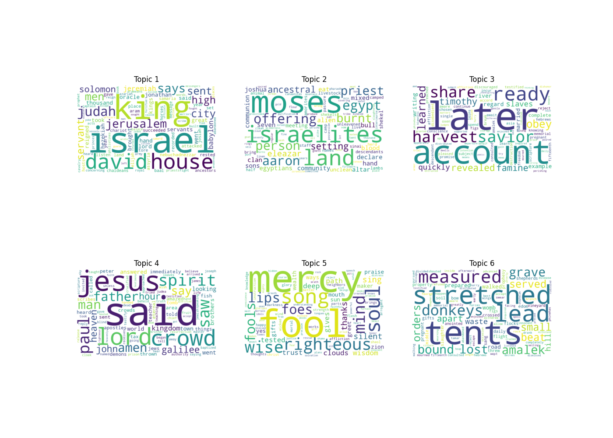
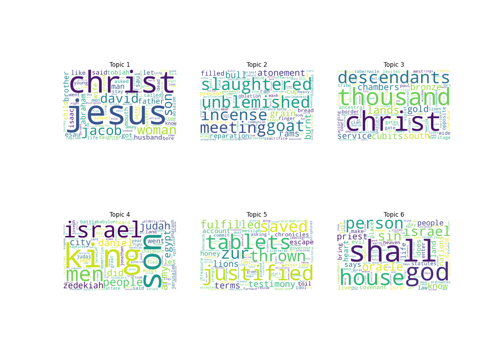
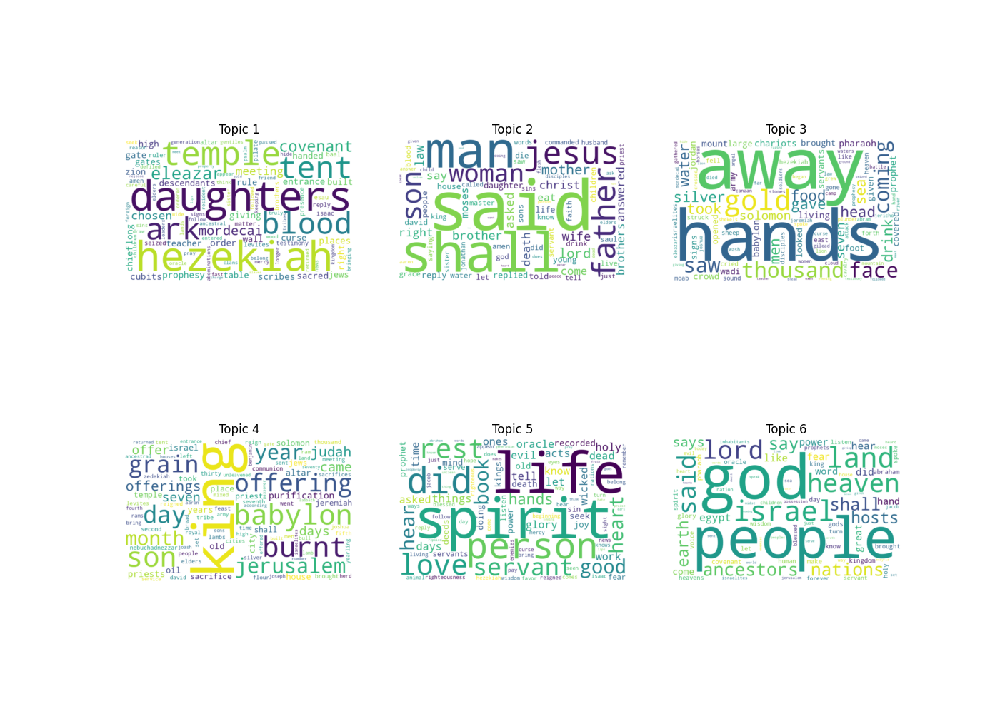

# Analyzing Bible and Lectionary Texts

## Experiment #1

### Varying document size in LDA

---------------------------------------

A Latent Dirichlet model considers a set of "topics", each a categorical distribution over a dictionary.  A "document" is generated by first fixing a distribution over topics, and then sampling each word independently by first picking a topic and then picking the word from the topic.

In many contexts (such as the [20newsgroups](http://qwone.com/~jason/20Newsgroups/)  dataset) it is apparent what a "document" should be. In the case of the Bible it is less obvious.  We are curious-- **does varying the document size qualitatively change the topics discovered?**

Our code follows the [prodlda tutorial](https://pyro.ai/examples/prodlda.html) from the [Pyro](https://pyro.ai) documentation.  We vary the training set, considering several ways of "documentizing" the Bible.

- by book
- by chapter
- by sentence

To execute the experiment yourself clone this repo, `cd` into the cloned directory.

1. Download google chrome (if you don't already have it) and check its version by going to `About Chrome` at the top navigation bar.  Find the corresponding version number and your OS [here](https://chromedriver.storage.googleapis.com/index.html).  Download the zip file and extract the driver into this directory.  Ensure that the name is `chromedriver`. This is a selenium driver for scraping text. I know there are simpler ways to download the bible in plain text, but I wanted the usccb's translation to be consistent with the lectionary for future experiments.
2. `chmod u+x chromedriver` to allow the driver to be executed.
3. `pip install -r requirements.txt` in your favorite python 3.x (virtual) environment.  I have only tested for python 3.6.8.
4. `python bible.py` to download the data using Selenium.
5. `python experiment1.py --help` to see possible cli arguments.

Below are three word clouds produced with the `document-segmentation` flag set to `book`, `chapter` and `sentence` respectively.  Other parameters were necessarily tweaked and can be parsed from the png filenames. (#TODO store this metadata in a better way.)  We leave it to you to come to your own conclusion about the qualitative differences.

---------------------------------------

---------------------------------------

